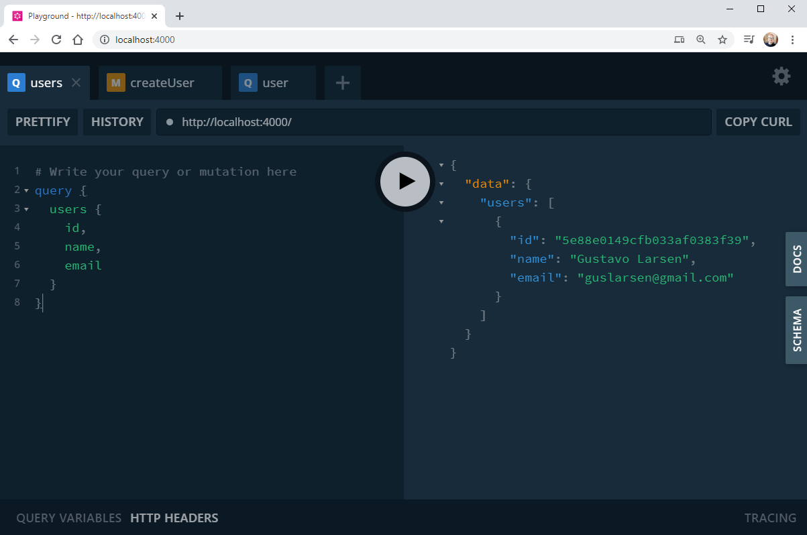

# graphql-node-mongodb
 Projeto de GraphQL e NodeJS com conexão ao MongoDB

<p align="center">
    
</p>


## Projeto

Um pequeno projeto de estudos de criação de API em NodeJS com GraphQL, cosumindo dados do MongDB rodando através do Docker


## Tecnologias

Esse projeto foi desenvolvido com as seguintes tecnologias:

- [NodeJS](https://nodejs.org/en/) 
- [GraphQL](https://graphql.org/) 
- [MongoDB](https://www.mongodb.com/) 
- [Docker](https://www.docker.com/) 

## Chamadas das Querys e Mutations

### Cadastro de usuário
```mutation {
  createUser(
    name:"Gustavo Larsen", 
    email: "guslarsen@gmail.com" ) 
  {
    id,
    name, 
    email
  }  
}
```


### Listagem de todos os usários
```
query {
  users {
    id,
    name, 
    email
  }
}
```


### Busca de usário por ID
```
query {
  user (id: "5e88e0149cfb033af0383f39") {
    name,
    email,
  }
} 
```


## Autor
Gustavo Larsen [@gustavoslarsen](https://twitter.com/gustavoslarsen)

