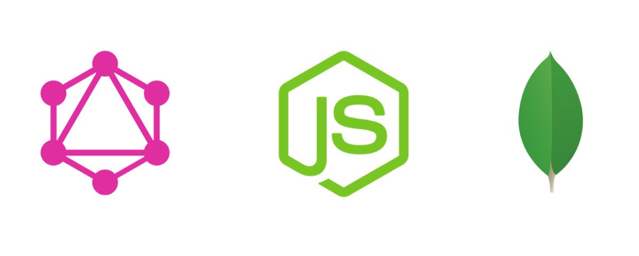
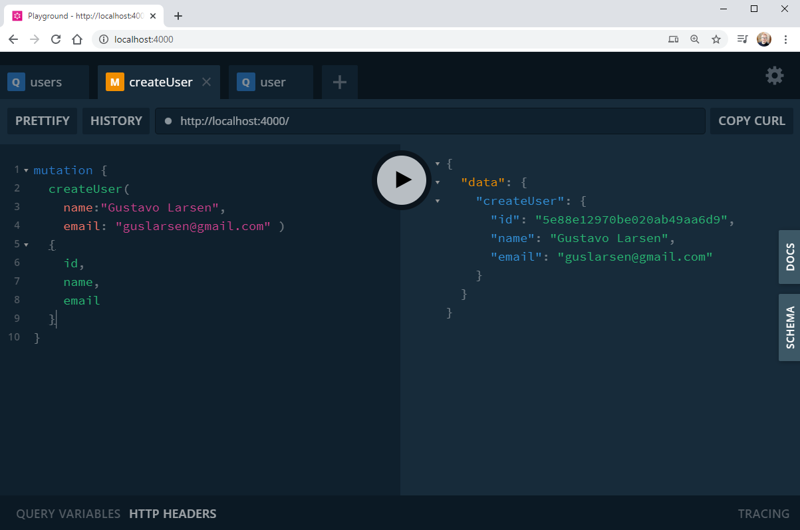
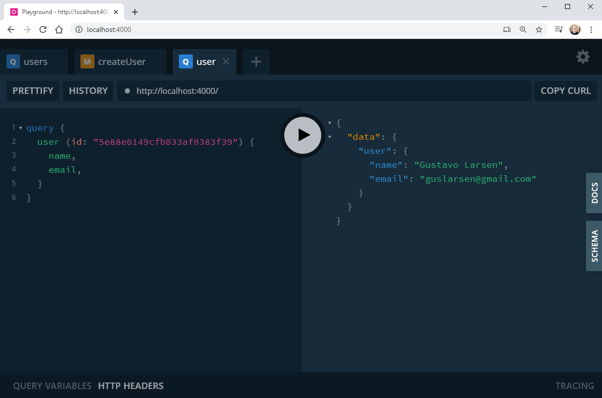

# graphql-node-mongodb
 Projeto de GraphQL e NodeJS com conexão ao MongoDB

<h2 align="center">
    
</h2>

## Projeto

Um pequeno projeto de estudos de criação de API em NodeJS com GraphQL, cosumindo dados do MongDB rodando através do Docker

## Tecnologias

Esse projeto foi desenvolvido com as seguintes tecnologias:

- [NodeJS](https://nodejs.org/en/) 
- [GraphQL](https://graphql.org/) 
- [MongoDB](https://www.mongodb.com/) 
- [Docker](https://www.docker.com/) 

## Telas

### Cadastro de usuário

### Listagem de todos os usários

### Busca de usário por ID

## Autor
Gustavo Larsen [@gustavoslarsen](https://twitter.com/gustavoslarsen)

